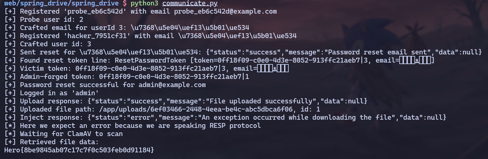

+++
type               = "ctf"
title              = "Spring Drive"
description        = "From String.hashCode() Collision to RCE via HTTP Method Injection"
author             = "conflict"
date               = "2025-12-01"
language           = "en"
tags               = ["web", "web-server", "java", "ssrf", "command injection", "clamav", "redis"]
event              = "HeroCTF 2025"
category           = "web"
difficulty         = "hard"
challenge_author   = "xanhacks"
challenge_author_url = "https://www.xanhacks.xyz/"
image              = "images/spring_drive.png"
pinned             = true
rating             = 8
solves             = 56
redirect_from      = ["/posts/2025/12/heroctf-2025-web-spring-drive/"]
+++

## Introduction

*Spring Drive* was a *hard* web challenge from HeroCTF 2025. 

It featured a Java Spring Boot application where the goal was to get Remote Code Execution by abusing three main vulnerabilities.

---

## TL;DR

- Reverse-engineer a custom password reset logic relying on Java's `String.hashCode()` method.
- Generate a hash collision to takeover the *admin* account.
- Exploit an *SSRF* in the "Remote Upload" feature by injecting malicious data into the `httpMethod` field.
- Smuggle *RESP* commands to the local Redis to poison the `clamav_queue`.
- Achieve *RCE* via Command Injection when the ClamAV worker processes the malicious `filename`.

---

## The Application

As stated in the introduction, the application's backend is coded in Java via the Spring Boot framework which is a classic in CTFs. The front-end uses Svelte, but this challenge doesn't involve any significant interaction with it.

`supervisord.conf`

```bash
[...]
[program:postgres]
command=/postgres_start.sh
autostart=true
autorestart=true
user=postgres

[program:redis]
command=redis-server --bind 127.0.0.1
autostart=true
autorestart=true
user=redis

[...]

[program:app]
command=java -jar /app/app.jardirectory=/app
autostart=true
autorestart=true
user=app
stdout_logfile=/app/app_stdout.log
stderr_logfile=/app/app_stderr.log
stdout_logfile_maxbytes=50MB
stderr_logfile_maxbytes=50MB
```

The `supervisord` configuration file holds interesting information we need to keep in mind for later, such as the presence of both *Postgres* and *Redis*.

`entrypoint.sh`

```bash
#!/bin/bash

echo "${FLAG:-HEROCTF_FAKE_FLAG}" > "/app/flag_$(openssl rand -hex 8).txt"

/usr/bin/supervisord -n
```

This file shows us that the flag is in the `/app` folder, and the name of the flag file is randomized which indicates that we will have to either find a way to enumerate the parent folder, or get a full *RCE* on the machine.

Now let's dig into the backend's source code to try and find interesting endpoints and methods.

`FileController.java` 

```java
[...]
@PostMapping("/remote-upload")
    [...]
        int userId = (int) session.getAttribute("userId");
        if (userId != 1) {
            return JSendDto.fail("You must be admin to access this feature.");
        }
[...]
```

The fact that the remote upload endpoint is only available to the admin suggests that the first step of the exploitation will be to become admin somehow before trying to exploit this.

`DataInitializer.java` 

```java
@Configuration
public class DataInitializer {

    private static final Logger logger = LoggerFactory.getLogger(DataInitializer.class);

    @Bean
    CommandLineRunner initDatabase(UserRepository userRepository) {
        return args -> {
            if (userRepository.findByUsername("admin") == null) {
                UserModel adminUser = new UserModel();
                // adminUser.setId(1);
                adminUser.setUsername("admin");
                adminUser.setEmail("admin@example.com");
                adminUser.setPassword(CryptoUtils.generateRandomHex());
                userRepository.save(adminUser);
                logger.info("Admin user created!");
            } else {
                logger.info("Admin user already created!");
            }
        };
    }
}
```

The admin user is created on the initialization of the app, and it indeed has the id 1 (even though the line is commented, the ID is 1 since it's the first user). Note that the admin's email is also static (`admin@example.com`), this will be useful later on.

---

## Breaking the Reset Logic

We'll focus on the password reset logic as this is the most interesting path to take over the admin account.

### Vulnerable Token Verification

`AuthController.java` 

```java
@RestController
@RequestMapping("/auth")
public class AuthController {
    [...]
    @PostMapping("/send-password-reset")
    [...]

        String email = sendResetPasswordDto.email();

        UserModel user = userService.findByEmail(email);
        if (user == null) {
            return JSendDto.fail("User not found");
        }

        ResetPasswordToken token = ResetPasswordStorage.getInstance().createResetPasswordToken(user);

        // FAKE EMAIL SERVICE
        [...]

        return JSendDto.success("Password reset email sent");
    }

    @PostMapping("/reset-password")
    public JSendDto resetPassword(@Valid @RequestBody ResetPasswordDto resetPasswordDto, BindingResult bindingResult) {
        if (bindingResult.hasErrors()) {
            String errorMessage = bindingResult.getAllErrors().stream()
                    .map(DefaultMessageSourceResolvable::getDefaultMessage)
                    .collect(Collectors.joining(", "));
            return JSendDto.fail("Validation failed: " + errorMessage);
        }

        String email = resetPasswordDto.email();
        String token = resetPasswordDto.token();
        String password = resetPasswordDto.password();

        int userId = ResetPasswordStorage.getInstance().getUserFromResetPasswordToken(
                email,
                token
        );
        UserModel user = userService.findUserById(userId);
        if (user == null) {
            return JSendDto.fail("Wrong email or token.");
        }

        user.setPassword(password);
        if (userService.saveUser(user) == null) {
            return JSendDto.fail("Password reset failed");
        }

        return JSendDto.success("Password reset successful");
    }
    [...]
```

Let's break down what these two endpoints do:

`/send-password-reset` takes the user email, gets the whole user object and calls `createResetPasswordToken(user)`.

`/reset-password` is a little bit trickier, it takes an email, a token and a password. It first tries to get the `userId` from the email and the token via `getUserFromResetPasswordToken()` and if that succeeds it gets the user from the ID and changes its password. *Notice that the provided password has never been checked*.

`ResetPasswordStorage.java` 
```java
public class ResetPasswordStorage {

    private static ResetPasswordStorage instance;
    private final ArrayList<ResetPasswordToken> resetPasswordTokens;

    private ResetPasswordStorage() {
        this.resetPasswordTokens = new ArrayList<>();
    }

    public static synchronized ResetPasswordStorage getInstance() {
        if (instance == null) {
            instance = new ResetPasswordStorage();
        }
        return instance;
    }

    private String createUniqueToken(UserModel user) {
        return UUID.randomUUID() + "|" + user.getId();
    }

    public ResetPasswordToken createResetPasswordToken(UserModel user) {
        ResetPasswordToken resetPasswordToken = new ResetPasswordToken(createUniqueToken(user), user.getEmail());
        resetPasswordTokens.add(resetPasswordToken);
        return resetPasswordToken;
    }

    public int getUserFromResetPasswordToken(String email, String uniqueToken) {
        ResetPasswordToken resetPasswordToken = new ResetPasswordToken(uniqueToken, email);
        if (resetPasswordTokens.contains(resetPasswordToken)) {
            return Integer.parseInt(uniqueToken.split("\\|")[1]);
        }
        return -1;
    }

}
```

This file shows us that a valid reset token looks like `<uuid>|<user_id>` and it stores the associated `user_email`. When a token is created by `createResetPasswordToken()` it is also stored in the `resetPasswordTokens` list.

The `getUserFromResetPasswordToken()` method is what makes everything come together.

First, it generates a `ResetPasswordToken` with the provided email and token.

Then, it calls `contains()` on the `ResetPasswordTokens` list. What this does is it goes through the list, and for each element it calls `element.equals(givenObject)`. 

If it finds a match in the list, it extracts the ID from the **provided token** and *not from the token in the list*.

`ResetPasswordToken.java` 

```java
package com.challenge.drive.util;

public class ResetPasswordToken {

    private String token;
    private String email;

    public ResetPasswordToken(String token, String email) {
        this.token = token;
        this.email = email;
    }

    [...]

    @Override
    public boolean equals(Object o) {
        return this.token.split("\\|")[0].equals(((ResetPasswordToken) o).token.split("\\|")[0]) && this.hashCode() == o.hashCode();
    }

    @Override
    public int hashCode() {
        return token.hashCode() + email.hashCode();
    }
}
```

This class overwrites `hashCode()` by making it the sum of the `hashCode()` of both the `token` and the `email` fields.

It also overwrites the `equals()` method and makes it separately compare the `token` *without* the ID and the `hashCode()` of the whole token (which is equal to the `hashCode` of the token + the `hashCode` of the email).

We saw earlier that `getUserFromResetPasswordToken()` is called and it compares tokens via the `equals()` method. Essentially, reseting a password works if:

- The provided UUID before the `|` exists in the storage.
- `hashCode(providedToken)` + `hashCode(providedEmail)` matches `hashCode(storedToken)` + `hashCode(storedEmail)`

### Generating the Hash Collision

Let's say we request a password reset for a probe user called `dummy` whose ID is `2`. Our goal is to reset the admin's password via creating a hash collision and the only value we don't know is our probe user's email. This gives us this equation when the token check is triggered:

`hashCode("<UUID>|1") + hashCode("admin@example.com") = hashCode("<UUID>|2") + hashCode(<unknown_email>)`

Since `<UUID>|1` and `<UUID>|2` only differ by one character, we can transform the equation into:

`hashCode(<unknown_email>) = hashCode("admin@example.com") + hashCode(<UUID>|1) - hashCode(<UUID>|2)`

`hashCode(<unknown_email>) = hashCode("admin@example.com") - 1` 

Now, we understand that we simply need to register a user with an "email" string whose hash satisfies this equation. This is possible because *the website's backend does not check if the provided email on register has a valid email format*.

To find the said email, we can write a script to reverse-engineer a valid string. Since Java's `String.hashCode()` is a polynomial rolling hash modulo 2^32, we don't need to brute-force the entire string blindly.

We can use a "meet-in-the-middle" approach or a smart solver:

- We fix a target length for our malicious email (e.g., 6 characters).
- We generate a random prefix of 5 characters and calculate its hash contribution.
- We mathematically determine exactly which integer value the **last character** must have to balance the equation and reach the target hash.
- If this integer corresponds to a valid printable Unicode character (excluding surrogates), we have found our collision.

We can now reset the admin's password by first registering a probe user to know which id we are at, then requesting a password reset token to get the UUID and add it into the storage. We solve the equation for the next ID and register the user with the valid email string before requesting a password reset with the email set to `admin@example.com` and the token to `<UUID>|1` so it resets the user 1's password (admin).


---

## Smuggling into Redis

Now that we are admin, we unlock the access to the `/api/file/remote-upload` endpoint. This feature allows the server to fetch a file from a URL provided by the user.

### SSRF via HTTP Method Injection

`RemoteUploadDto.java` 

```java
public record RemoteUploadDto(
        @NotBlank(message = "URL is required")
        @Size(min = 3, max = 2048, message = "URL must be between 3 and 2048 characters")
        String url,

        @NotNull(message = "Filename is required")
        @NotBlank(message = "Filename is required")
        @Size(min = 1, max = 255, message = "Filename must be between 1 and 255 characters")
        String filename,

        @NotBlank(message = "HTTP method is required")
        @Size(min = 3, max = 255, message = "HTTP method must be between 3 and 255 characters")
        String httpMethod
) {
    public RemoteUploadDto(String url, String filename) {
        this(url, filename, "GET");
    }
}
```

The vulnerability lies in the fact that the `httpMethod` is only validated for its length (3 to 255 characters), there is *no whitelist* (e.g., `GET`, `POST` only).

`FileController.java`

```java
@PostMapping("/remote-upload")
    [...]
        String method = remoteUploadDto.httpMethod();
        String remoteUrl = remoteUploadDto.url();

        try {
            Path uploadPath = Paths.get(Constants.UPLOAD_DIR);
            if (!Files.exists(uploadPath)) {
                Files.createDirectories(uploadPath);
            }

            OkHttpClient client = new OkHttpClient();
            Request request = new Request.Builder()
                    .url(remoteUrl)
                    .method(method, null)
                    .build();
[...]
```

The `OkHttpClient` builds the raw HTTP request. Since we control the HTTP verb, we can inject **CRLF sequences** (`\r\n`) to break out of the HTTP protocol structure.

### Crafting the RESP Payload

We know Redis is running on `127.0.0.1:6379`. By targeting this URL and injecting malicious data into the `httpMethod`, we can make the Java backend send a valid *RESP (Redis Serialization Protocol)* command to the local Redis instance.

The application uses a `clamav_queue` list in Redis to process files. Our goal is to push a malicious payload into this list using the `LPUSH` command.

After our injection, the final request crafted by `OkHttp` will look like this:

```java
GET / HTTP/1.1
Host: 127.0.0.1:6379

*3
$5
LPUSH
$12
clamav_queue
$<PAYLOAD_LENGTH>
<PAYLOAD>
```

When `OkHttp` sends this, Redis ignores the garbage *HTTP* headers and executes the valid *RESP* block that starts at `*3`.

---

## Weaponizing the Antivirus

We have a way to write data into the `clamav_queue`. Now we need to understand how that data is processed.

Let's analyze the ClamAV service. This service connects to the local Redis instance and implements a scheduled task to process the file queue.

`ClamAVService.java` 

```java
@Service
public class ClamAVService {
[...]
    @Scheduled(fixedRate = 60 * 1000)
    public void scanAllFiles() {
        logger.info("Scanning all files...");
        while (!this.isEmpty()) {
            String filePath = this.dequeue();
            logger.info("Scanning file {}...", filePath);
            if (!this.isFileClean(filePath)) {
                try {
                    Files.deleteIfExists(Paths.get(filePath));
                } catch (IOException ignored) {
                    logger.error("Unable to delete the file {}", filePath);
                }
            }
        }
    }
[...]
}
```

The `@Scheduled(fixedRate = 60 * 1000)` indicates that the scanner only wakes up **once every minute**.

The vulnerability lies in the `isFileClean()` method. The backend constructs the command using `String.format` and, critically, executes it using `/bin/sh -c`.

`ClamAVService.java` 

```java
@Service
public class ClamAVService {
[...]
    public boolean isFileClean(String filePath) {
        String command = String.format("clamscan --quiet '%s'", filePath);
        ProcessBuilder processBuilder = new ProcessBuilder("/bin/sh", "-c", command);

        try {
            Process process = processBuilder.start();
            return process.waitFor() == 0;
        } catch (Exception ignored) {
            logger.error("Unable to scan the file {}", filePath);
        }
        return false;
    }
}
```

This is the "smoking gun". By using `/bin/sh -c`, the application allows shell interpreters (like `;`, `|`, `>`) to function. Since we directly injected the file name into the Redis database, it has not been sanitized at all and can contain a full `bash` payload.

We need to escape the single quotes inside the `String.format`.

Command constructed by Java:
```bash
clamscan --quiet 'PAYLOAD'
```

Our Payload:
```bash
x'; cat /app/flag* > /app/uploads/<UUID> #'
```

Resulting Command: 
```bash
clamscan --quiet 'x'; cat /app/flag* > /app/uploads/<UUID> #''
```


---

## Pulling the Trigger

Now it's time to piece it all together and get the flag !

### Full Exploitation Path

- **Reconnaissance:** Identify admin credentials and ID `1` from initialization files.
- **ATO (Breaking the Maths):**
    - Register a "Probe" user (ID 2).
    - Calculate the "Magic Email" collision string (`Hmagic=Hadmin−1`).
    - Register a "Hacker" user with this email.
    - Reset Hacker's password, intercept the token (`<UUID>|2`).
    - Submit the reset using `<UUID>|1` to takeover the admin account.
- **Preparation:**
    - Log in as admin.
    - Upload a placeholder file via the web interface.
    - Note its server-side path (e.g., `/app/uploads/ed42-89...`) and its `fileId`.
- **Injection:**
    - Send the SSRF payload to `/file/remote-upload` targeting `http://127.0.0.1:6379`.
    - Inject the RESP `LPUSH` command in `httpMethod`.
    - Payload: `LPUSH clamav_queue "x'; cat /app/flag* > /app/uploads/ed42-89... #'"`
- **Exfiltration:**
    - **Wait ~120 seconds** for the `@Scheduled` task in `ClamAVService` to trigger twice to make sure it works.
    - Call `/file/download` with the `fileId` of our placeholder.
    - The file content has been overwritten by the flag.

### Solve Script

The full automated solve script is available below.



---

## Conclusion

This was an incredible challenge made by **xanhacks**, I learned a lot while solving it and it was really fun, GG!
